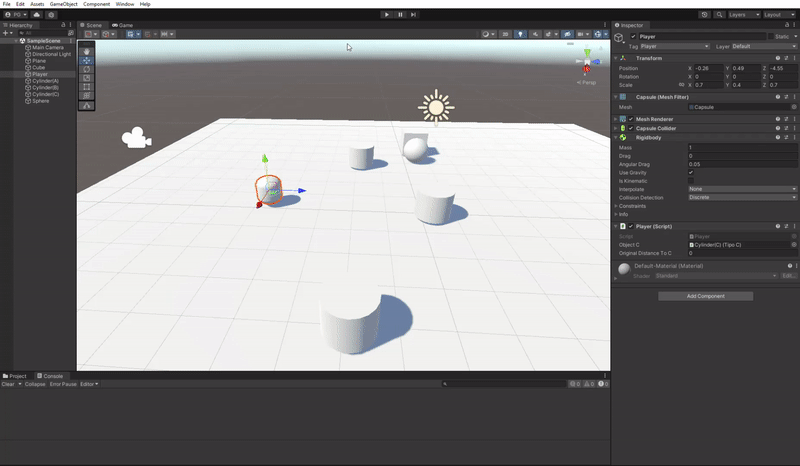

# II-P03-Events

## Crear una escena simple en Unity, con dos objetos: Notificador y Suscriptor y prueba el código en las transparencias.  

Para esto se creó un cubo y una esfera, siendo la esfera el notificador y el cubo suscriptor. Cada 1000 frames, el notificador lanza el mensaje y el suscriptor cambia de color.  

## Crear una escena en Unity, con objetos de tipo A, B y un único objeto C con los siguientes comportamientos.

Se crean 3 cilidros, cada uno con un tag "tipo A/B/C" y un jugador que se mueve mediante las teclas W, A, S, D.

### Player

En el método Update() se establece el movimiento del personaje y se calcula la distancia con el objeto tipo C, se compara con la distancia en el frame anterior, y si esta se ha reducido (está más cerca), se lanza el mensaje "changeColorAndJumpA()" y "orientToSomeone()", donde el primero tiene como suscriptor el objeto tipo A y el segundo el tipo B.  

Por otro lado, en caso de colisión con un objeto tipo A o B se lanzan otro mensajes.  

### Tipo A

Se almacena un objeto tipo Player, otro TipoB y otro TipoC para poder hacer todas las interacciones necesarias (luego, desde la interfaz de Unity se referencia qué entidad es). Posteriormente se definen los métodos MoveToC(), donde el objeto rota y avanza hacia C, y el método changeColorAndJump, que cambia de color aleatoriamente y se desplaza en el eje vertical. Además, en el caso de recibir un mensaje de colisión de Player, se lanza un mensaje "OnMakeBiggerB()" cuyo suscriptor es de tipo B.   

### Tipo B

Se almacena un objeto tipo Player y otro TipoA. Se definen los métodos makeBigger(), que aumenta el tamaño del objeto, y orient(), que rota el objeto hasta tener a un objeto TipoA delante. En el casod e recibir un mensaje de colisión de player, se lanza un mensaje "MoveAtoC()", cuyo suscriptor es de tipo A.

### Tipo C

Dada la configuración y la estructura de la actividad, no hizo falta escribir ningún método particular
